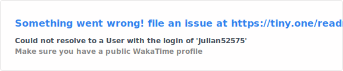

# 👋 Hello, I'm Julian Bottiglione! ✨

##### Updated on May 2nd 2026
## 🔭 About Me

I'm a passionate programmer who strives to better my skills every day.  
I'm driven by a desire to become the most skilled developer you will ever met and, if I'm not, I still be someone memorable.    

## Current goals

- Balancing workload between AIs tools and me to maximise code quality at the lowest effort cost.
- Utilizing my background in Haskell and contracts to specializing in digital contract.

## ✨ Projects

[Here is a list and retrospective on my past projects](https://github.com/Julian52575/Learning-Experiences/blob/main/README.md).  

## 🤝 Collaboration

I'm always open to collaborating on exciting projects!  Feel free to reach out:

*   **Email:** [julian.bottiglione@epitech.eu](mailto:julian.bottiglione@epitech.eu)
*   **LinkedIn:** [Julian Bottiglione](https://fr.linkedin.com/in/julian-bottiglione-%C3%A9tudiant-en-informatique-55550b264/en)

---

    

 

---
Made with ❤️ and Markdown
